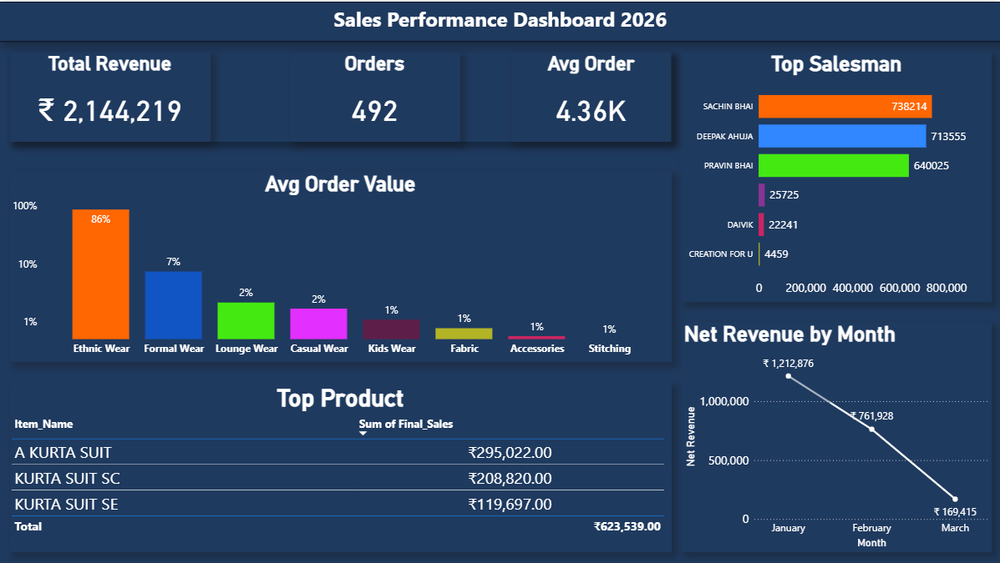

# 📊 Sales Performance Dashboard

## 🔥 Project Overview
This project analyzes sales data using Power BI to generate insights about revenue, sales trends, and product performance.

## 📌 Features
- KPI metrics (Revenue, Orders, Avg Order)
- Sales by Category
- Salesman Performance
- Monthly Trend Analysis
- Top Products Table

## 🛠 Tools Used
- Power BI
- MySQL
- Excel

## 📷 Dashboard Preview

## 🚀 Insights
- Ethnic wear contributes highest revenue
- Sales dropped after February
- Top salesman identified
- Returns impact analyzed
